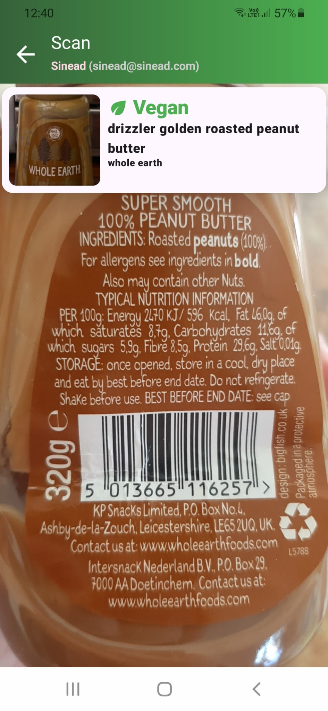
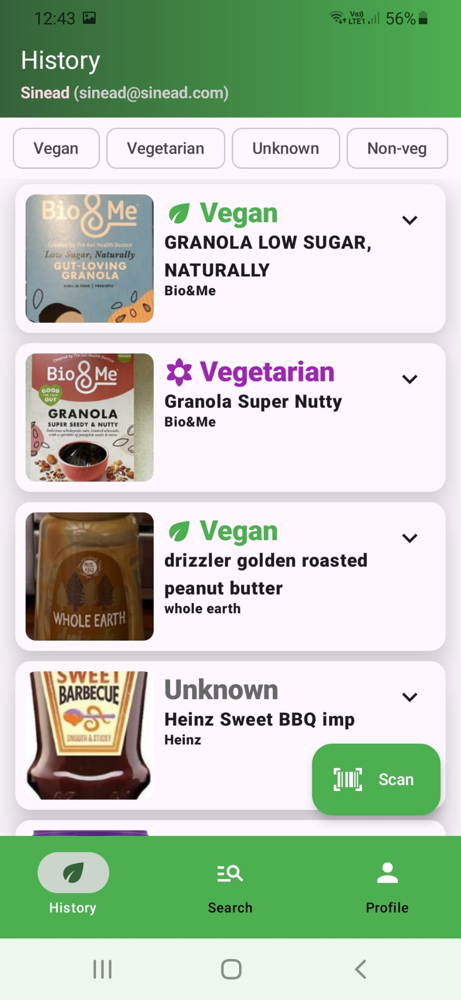
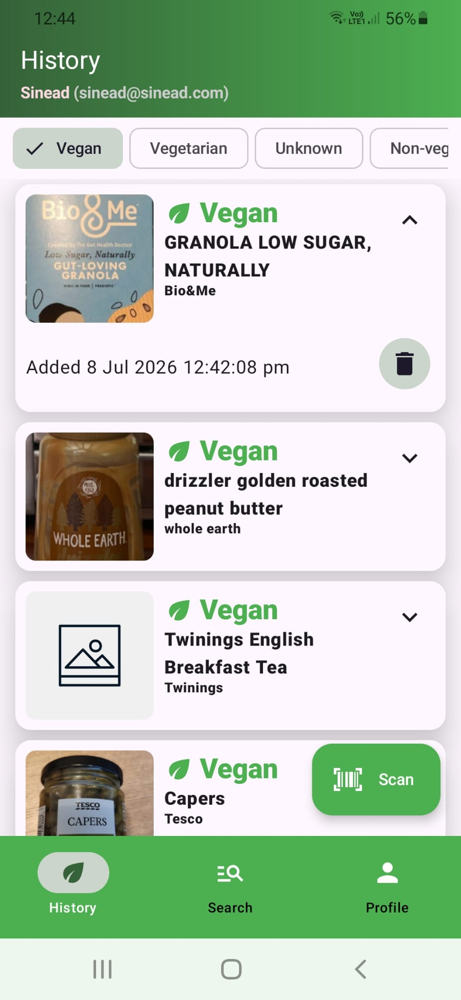
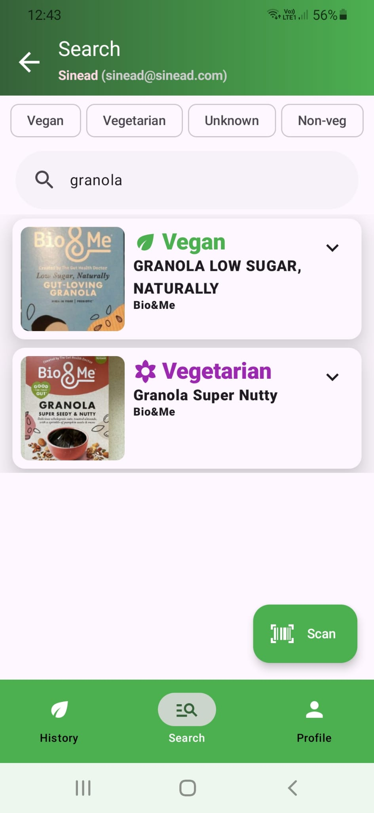

# Vegi
**Vegi** is a native Android application built with Kotlin and Jetpack Compose used for scanning products to determine whether they are vegan, vegetarian, or neither.

[Demo video](https://www.youtube.com/watch?v=8DyxmqrNoUo)

## Features
- Scan product barcodes using the device camera.
- Retrieve product information from the Open Food Facts API.
- Display product name, brand, image, and dietary classification (vegan, vegetarian, non-vegan, or unknown).
- Automatically save scanned products to a history list.
- Search and filter previously scanned products by name, brand, or dietary classification.
- Delete individual products or clear scan history.
- Sign in using email/password or a Google account.
- Update profile pictures, stored using Firebase Storage.

## Screenshots
<table>
  <tr>
    <th>Barcode scanning</th>
    <th>Scanned products history</th>
    <th>Filtering by dietary classification</th>
    <th>Search scanned products</th>
  </tr>
  <tr>
    <td></td>
    <td></td>
    <td></td>
    <td></td>
  </tr>
</table>

## Technologies
- Kotlin
- Jetpack Compose
- Android Studio
- Firebase Authentication
- Firebase Firestore
- Firebase Storage
- Open Food Facts API

## Installation instructions
1. Clone the repository.
2. Open the **`Vegi`** folder in Android Studio.
3. Add your own `google-services.json` file to the `app/` directory.
4. Sync the Gradle project.
5. Build and run the application on an Android device or emulator.
